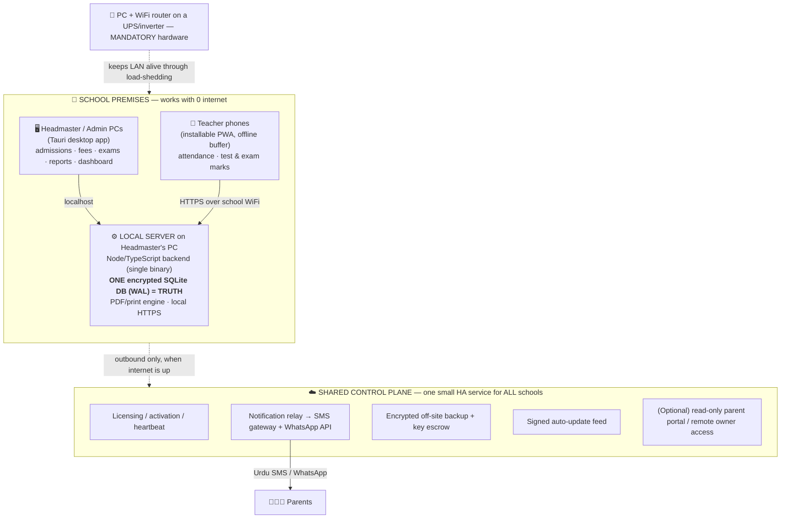

# 01 — Architecture & Tech Stack

## The three forces that constrain every decision

1. **Load-shedding and dead internet.** The critical path — attendance, fees, exams — must run with **zero** cloud dependency. If the system needs the internet to take a fee payment, it is useless here.
2. **A low price, sold per school.** We cannot carry a per-tenant cloud server bill for hundreds of schools. Recurring cost per school must be a few rupees, not a server.
3. **A small team building a cheap product.** We cannot afford to hand-build and debug a bidirectional sync/conflict engine — the single most bug-prone thing in systems like this.

## The decision: local-first hybrid, one authoritative database

We evaluated four architectures:

| Option | Summary | Verdict |
|---|---|---|
| **A. Pure cloud SaaS** | Both surfaces are web apps against one cloud DB | ❌ Dies during power/internet outages; per-tenant cost; per-student billing hated locally |
| **B. LAN-local server** | Backend runs on the headmaster's PC on the school LAN; desktop + teacher phones are clients; cloud only for messages/backup | ✅ **Chosen** |
| **C. Offline desktop syncing to a cloud portal** | Local DB syncs bidirectionally to a cloud teacher/parent portal | ❌ Requires the exact sync/conflict engine we must avoid; money/marks get auto-merged |
| **D. Generic hybrid** | Mix of the above | Folded into B where useful (cloud is outbound-only) |

**We build Option B: a local-first hybrid.** The reasoning is decisive, not taste.

### The linchpin: one database, never two
There is **exactly one authoritative database per school** — a single encrypted SQLite file on the headmaster's PC. The desktop admin app and the teacher web app are **both clients of the same local server**:
- The headmaster's desktop app talks to `localhost`.
- Teachers' phones open the teacher app over the school WiFi (see the **secure-context** note below — this is not a naïve `http://ip:port`).

Because there is one source of truth accessed live over the LAN, **there is no bidirectional database sync and no conflict-resolution engine to build.** The biggest source of cost, bugs, and wasted time is designed out of existence. The internet is used only for delay-tolerant work.

## The system diagram

**Nothing authoritative ever flows *back down* into the school DB from the cloud** — so there is nothing to merge. The cloud pushes messages out, stores encrypted backups, checks licenses, and serves updates. That's it.

## The tech stack

| Layer | Choice | Why (tuned for Pakistan) |
|---|---|---|
| **Desktop shell** | **Tauri** (Rust shell), not Electron | ~5–15 MB installer vs 100 MB+ (matters for USB installs / slow links); ~60–150 MB RAM vs 300–500 MB (matters on 4 GB office PCs); signed built-in auto-updater. Bundles and supervises the local backend as a "sidecar" process. |
| **Teacher app** | **React + Vite + TypeScript**, installable **PWA**, mobile-first | Low-bandwidth, works on 3G, installs to the home screen. **IndexedDB write-buffer** so a WiFi blip never loses a class's marks. Urdu output + icon-driven UI for low-literacy teachers. |
| **Backend** | **Node.js + TypeScript (Fastify)**, packaged as one self-contained executable | One language across all three surfaces → shared types, small team, large local hiring pool. Developer time is the dominant cost of a cheap product. |
| **Database** | **SQLite in WAL mode** (encrypted via SQLCipher), one file per school | Embedded, zero-admin; backup = copying one file. Easily handles 1,000 students + years of history. A single-writer queue + `busy_timeout` serialize the rare concurrent writes. Postgres is used **only** for the shared cloud control plane. |
| **Reporting / print** | Server-side HTML→PDF via bundled headless Chromium for high-fidelity bilingual/RTL result cards & challans; SheetJS for Excel export | All generation is **local** → documents print with zero internet, on cheap B&W printers, on A4 and thermal roll formats. |
| **Backup** | **Litestream** streaming the SQLite file to Backblaze B2 / Cloudflare R2 (pennies/school) **+** scheduled USB backup, with **key escrow** (below) | Off-site disaster recovery is **default-on and non-optional**. |
| **Control plane** | One small **highly-available** service (managed VPS + warm standby) for **all** schools: licensing, notification relay, update feed, backup coordination | Amortized across hundreds of schools → a few rupees each. See availability note below. |
| **Remote access** | **Cloudflare Tunnel / Tailscale** into the single LAN server | Lets an at-home owner reach the app *without ever building a second database.* |
| **Mandatory hardware** | **UPS/inverter on the server PC + WiFi router** (cheap and standard in Pakistan) | Keeps the LAN alive through load-shedding. Optionally bundled with a cheap mini-PC (Intel N100, ~PKR 25–40k). |

## Hard technical decisions the first draft got wrong (and how we fix them)

These are corrections a skeptical review forced. They are load-bearing — getting them wrong later would cost weeks.

### 1. The teacher app cannot run over `http://<lan-ip>:port` — it must be HTTPS-on-LAN
Browsers only grant **service workers**, reliable offline IndexedDB, and "Add to Home Screen" to a **secure context** — i.e. `https://` or `localhost`. A plain `http://192.168.x.x:port` origin is **not** secure, so the flagship "offline mark capture on a teacher's phone" would silently not work.
**Fix (proven in Phase 0, before any feature):** the desktop installer provisions a small **locally-trusted certificate** for a **stable hostname** (via a self-managed mini-CA installed to teacher devices, or an mDNS/`.local` hostname with a bundled cert), and the local server serves the teacher app over **HTTPS**. Phase-0 Definition of Done: *a teacher phone installs the PWA and marks a full class offline over the LAN, then flushes on reconnect.*

### 2. LAN reachability must be robust, not a raw IP
DHCP can change the PC's IP; school WiFi often doesn't reach classrooms.
**Fix:** provision a **static IP or mDNS hostname** so the teacher URL never changes; ship a **QR code / bookmark** for one-tap access; and set the honest expectation that where WiFi is weak, teachers mark in the staffroom right after class (still offline-buffered). WiFi coverage is a **pre-install checklist item**.

### 3. Offline durability has a real (small) window — we bound it honestly
Unsynced marks live in **per-device, per-browser IndexedDB** until they reach the LAN server. A cleared browser, reinstalled PWA, or a lost phone loses that buffer.
**Fix:** flush **immediately and opportunistically** whenever the LAN is reachable; show an explicit **"N unsynced entries"** warning that blocks risky actions; server-side draft autosave the instant any connectivity exists. The residual loss window is documented, not hidden.

### 4. Concurrency is guarded by row-versioning + finalize-lock, not "impossible by construction"
The `{class, section, date}` partition does **not** make conflicts impossible — the same teacher can write from two devices, an offline edit can race a later desktop correction, or an admin can override a teacher.
**Fix (the real mechanism):** **server-side row versioning with stale-write rejection**, plus **finalize-and-lock**; after lock, the *only* mutation route is a logged, reasoned correction. MVP attendance is **once-daily, class-teacher-marked** (`UNIQUE(enrollment_id, date)`); per-period attendance is a later option with its own key. We say "tamper-evident and conflict-guarded," never "impossible."

### 5. The control plane is a single point of failure unless we design for it
One tiny VPS handling licensing + relay + updates + backups for *all* schools would, on an outage, cut parent comms fleet-wide and risk tipping licenses to read-only.
**Fix:** **decouple licensing from relay uptime** — licenses carry a **long, generous offline grace** (14–30 days) so a relay outage never locks a paying school; use a **managed/redundant queue + object storage** for the relay and backups; run at least a **warm standby + monitoring/alerting** on the control plane. Enforcement lives in the signed local app, not in an always-on server call.

## Notification stack (matches the real parent-channel reality)

Schools **never** hold gateway credentials themselves. The school server POSTs a *message intent* to the shared cloud relay, which fans out, **meters usage per school** (this is also the monetization + anti-piracy lever), and retries through outages.

- **MVP automated channel = SMS** via a Pakistani bulk-SMS aggregator through our relay. SMS is the only channel that is **truly automatable and universal** on day one. Launch on unmasked SMS; switch to a **masked/branded sender ID** once PTA/gateway approval lands — **do not block launch on masking.**
- **WhatsApp = fast-follow**, via the **WhatsApp Business Cloud API (WABA)**. Automation requires **Meta Business verification** (weeks of lead time) and is **priced per conversation/template** — so it is *not* the free, instant primary the first draft implied. Until WABA is live, WhatsApp is only a **manual click-to-send deep link**, which cannot be automated. See the honest cost table in [`06-COMMERCIAL.md`](06-COMMERCIAL.md).
- **Email** — fallback for the **owner's** reports only, never parents.

## Data flow, end to end (the "how does it all connect" answer)

1. A teacher opens the PWA over the school HTTPS-LAN, marks attendance offline; it buffers locally and flushes to the **one** SQLite DB on the headmaster's PC.
2. The class teacher **finalizes** the day → the record locks; the day's **attendance sheet PDF** is generated locally for the headmaster.
3. The server queues **absentee alert intents** and, when internet is available, POSTs them to the cloud **relay**, which sends **Urdu SMS** to the flagged parents and logs delivery.
4. Every attendance, mark, fee, and discount lands in the **student's lifelong profile**, visible in the desktop app.
5. Continuously, **Litestream** streams the encrypted DB off-site; nightly, a **USB backup** is taken; the desktop shows a **"last backup: X" light** that turns red after 48h.
6. Periodically the app **heartbeats** the license and pulls **signed updates**; none of this touches the authoritative data.

See [`02-DATA-MODEL.md`](02-DATA-MODEL.md) for how the data is shaped, and [`04-RISKS-AND-SAFEGUARDS.md`](04-RISKS-AND-SAFEGUARDS.md) for how each failure mode is defeated.
