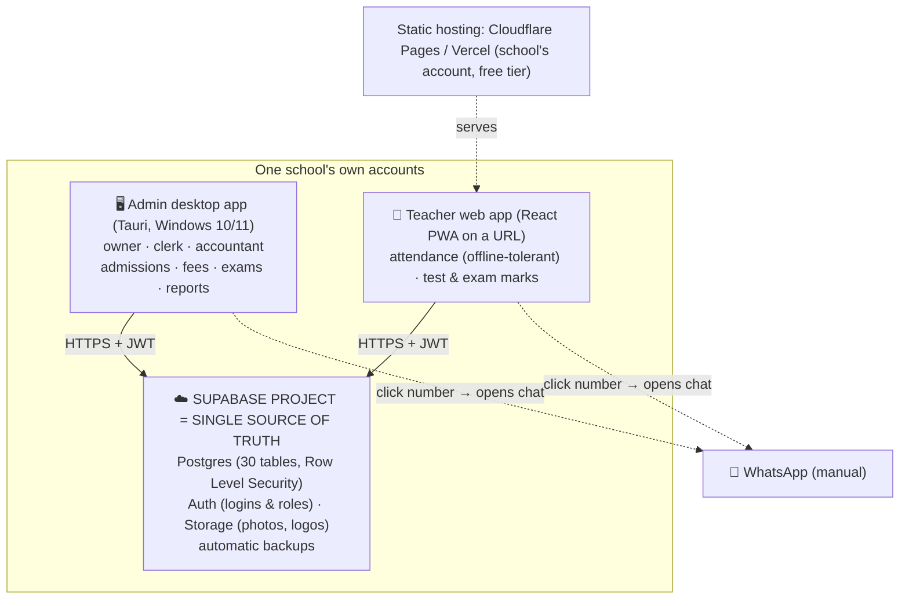

# 01 — Architecture & Tech Stack

> ## ⚠️ Superseded on the deployment and commercial model
>
> This document describes the **per-school self-hosted** model: a separate
> Supabase project per school, owned and run by the school, with the vendor
> hosting nothing and charging a one-time licence.
>
> **That is not how the product works.** All schools now share ONE Supabase
> project; the vendor runs it and bills a **subscription**, with an operator
> console for renewals, invoices and support. See
> [`09-DECISIONS-LOCKED.md`](09-DECISIONS-LOCKED.md) and
> [`SUPER-ADMIN-DESIGN.md`](SUPER-ADMIN-DESIGN.md).
>
> Kept for the reasoning, which is still worth reading. Do not build from the
> architecture or the pricing.

> **This document was rewritten to match the finalized deployment model** (each school self-hosts on its own Supabase). See [`09-DECISIONS-LOCKED.md`](09-DECISIONS-LOCKED.md) for the decisions that drove it.

## The model in one line
Each school runs its **own Supabase project** (cloud Postgres + Auth + Storage) as the single source of truth. The **admin "desktop" app** and the **teacher "live web" app** are the **same application**, role-based, both talking to that one Supabase database. One database ⇒ **no two-database sync engine to build.**

## The three forces
1. **Each school self-hosts on its own accounts.** The seller sets it up, then the school owns its backend/data. So the product must be a generic app + a database schema that stamps out per school — no shared infrastructure.
2. **The seller carries no per-school running cost.** Supabase/hosting are on the school's account (free tier to start).
3. **A small team can't hand-build a sync/conflict engine.** Using one cloud database for both surfaces removes that entire class of bugs.

## The pieces

- **The admin app and the teacher app are one React codebase.** The teacher URL is that app deployed to static hosting; the desktop app is the same app wrapped in Tauri for the headmaster's PC. Which modules a user sees is decided by their **role**.
- **All data reads/writes go straight to Supabase** over HTTPS with a per-user JWT; **Row Level Security** in Postgres decides what each role may see or change.
- **WhatsApp is not a system** — the student profile shows a number that, when clicked, opens WhatsApp with that contact for the staff to chat manually.

## The tech stack

| Layer | Choice | Why |
|---|---|---|
| **App (both surfaces)** | **React + Vite + TypeScript + Tailwind**, delivered as a mobile-friendly **PWA** | One codebase for admin + teacher; fast on phones; installable; typed end to end |
| **Backend** | **Supabase** per school — Postgres + Auth + Storage + auto-generated API | Zero backend to hand-build; managed Postgres with backups; Auth + RLS give logins and permissions out of the box; generous free tier |
| **Database** | **Postgres 16** with **Row Level Security** | The real enforcement of roles/append-only/audit lives in the DB, so it holds no matter which client connects. Schema in `supabase/migrations/`. |
| **Desktop wrapper** | **Tauri** (Windows 10/11 `.msi`), tiny wrapper around the web app | A proper installed program with an icon + native printing; ~5–15 MB installer. Built via CI (no Mac/Linux target). |
| **Web hosting** | **Cloudflare Pages / Vercel** free tier, on the school's account | The teacher URL; zero cost; deploy from GitHub |
| **Printing / documents** | Client-side print-to-PDF (browser print + print CSS) for challans, receipts, result cards, certificates | Prints locally on cheap printers; English-only keeps layout simple |
| **Offline resilience** | **IndexedDB write-queue for attendance**, flushes to Supabase on reconnect | The one daily-critical action survives a connectivity blip (see trade-off below) |
| **Data export** | In-app **"Export all data"** (Excel/CSV + PDF archives) | The school always owns its data, independent of anything the seller runs |

## Security model (enforced in the database, not just the UI)
- **Auth:** Supabase Auth issues a JWT per login. `auth.uid()` identifies the user in every query.
- **Roles:** a `profiles` row per user carries a `role` (`owner`, `principal`, `admin_clerk`, `accountant`, `class_teacher`, `subject_teacher`, `readonly`). A `has_role()` helper drives RLS.
- **Separation of duties:** clerks collect fees but cannot void payments or change marks; teachers write only attendance/marks; only owner/principal grant discounts or change roles (a trigger blocks role escalation).
- **Append-only money/marks/attendance:** `payments` have no UPDATE/DELETE policy (reversals are new rows); attendance/marks lock after finalize; corrections are logged.
- **Audit log:** a `SECURITY DEFINER` trigger writes a before/after record for every change to payments, discounts, adjustments, marks, attendance, and certificates. Owner/principal can read it; nobody can edit it through the app.
- **Gapless numbering:** `next_counter()` issues sequential receipt/GR/certificate serials (a gap is a visible red flag).

All of the above is implemented and **validated on Postgres 16** in `supabase/migrations/0001_core_schema.sql` (30 tables, 61 policies).

## Honest trade-offs (unchanged truths)
- ⚠️ **Cloud backend needs internet.** During a combined power + internet outage the app is unavailable. Mitigation: attendance is offline-tolerant; the school needs a reliable connection + a UPS. If a school's outages are severe, we can revisit a local option for that school.
- ⚠️ **Windows 7/8 can't run modern desktop app frameworks in 2026.** Target is **Windows 10/11**; older machines fall back to the browser (best-effort).
- ⚠️ **Per-school setup is manual** (Supabase + hosting + install per sale). Mitigated by a tight, scripted playbook — see [`SETUP-PER-SCHOOL.md`](SETUP-PER-SCHOOL.md).
- ⚠️ **Audit is tamper-evident, not tamper-proof** in spirit — but note it is now stronger than the old local-file design, because the data lives in **Supabase (server-side Postgres)** where staff never hold the raw database file. RLS + append-only policies are enforced server-side.

## End-to-end data flow (attendance example)
1. A teacher opens the app URL on their phone, signs in (Supabase Auth), and marks their class.
2. Marks are written to `attendance_daily` in Supabase; if the connection blips, they queue in IndexedDB and flush on reconnect.
3. The class teacher **finalizes** → rows lock; the daily attendance sheet is generated (print-to-PDF) for the headmaster.
4. Every attendance/mark/fee lands in the student's profile, visible to admin roles in the desktop app.
5. Staff can tap a parent's WhatsApp number to message them manually about the day.
6. Supabase keeps automatic backups; the owner can **Export all data** anytime.

See [`02-DATA-MODEL.md`](02-DATA-MODEL.md) for the schema and [`04-RISKS-AND-SAFEGUARDS.md`](04-RISKS-AND-SAFEGUARDS.md) for how each failure mode is handled (note: the licensing/messaging/Urdu items there are superseded by [`09-DECISIONS-LOCKED.md`](09-DECISIONS-LOCKED.md)).
